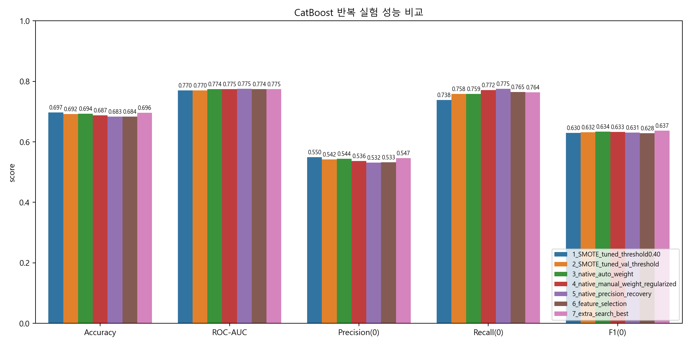
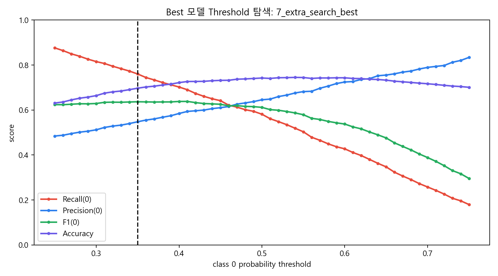
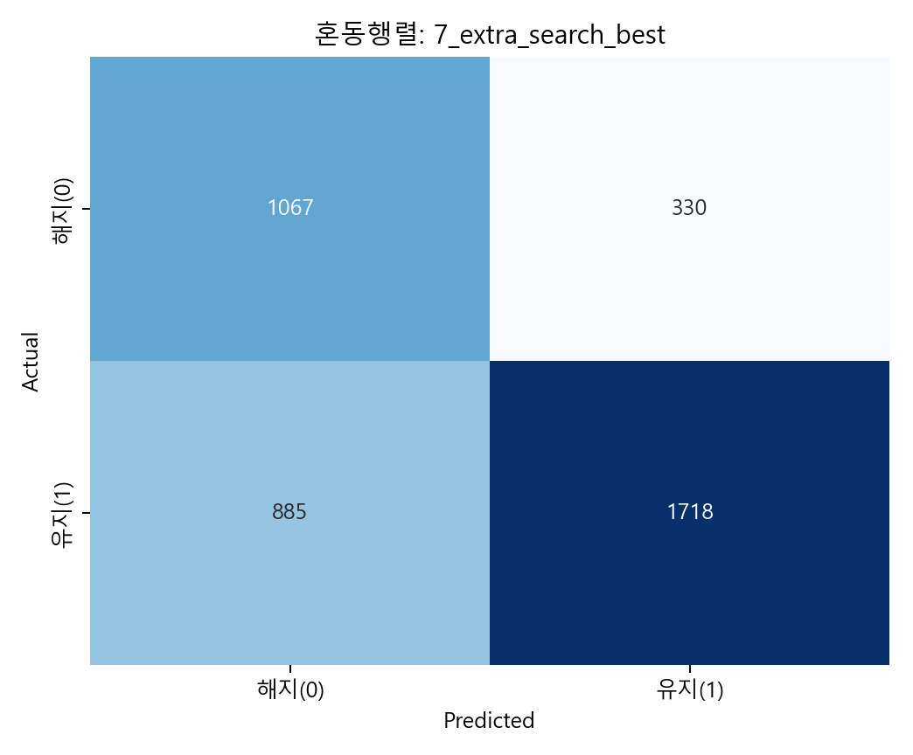
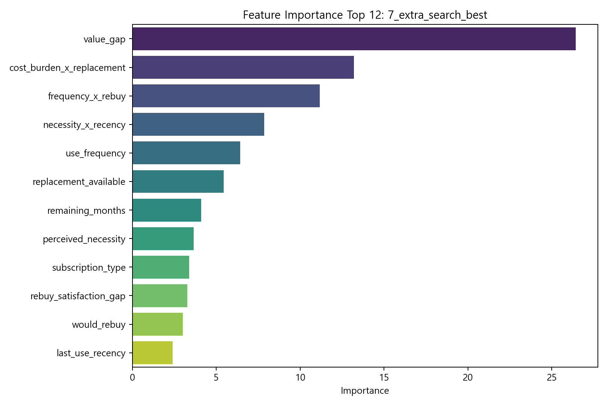

# 제출 3. CatBoost 모델 반복 수정 기록

## 1. 목표

이번 제출의 핵심은 CatBoost 모델을 한 번만 수정하는 것이 아니라, **여러 번의 수정 실험을 통해 성능이 어떻게 달라졌는지**를 기록하는 것이다. 2차 제출에서 CatBoost는 해지 후보(class 0)를 비교적 잘 찾는 모델이었지만, 여전히 실제 해지 후보를 놓치는 비율이 있었다.

따라서 3차 제출에서는 다음 지표를 우선순위로 두었다.

| 우선순위 | 지표 | 이유 |
| --- | --- | --- |
| 1 | Recall(0) | 실제 해지 후보를 놓치지 않는 것이 가장 중요 |
| 2 | F1(0) | Recall만 높이고 오탐이 너무 커지는 문제를 방지 |
| 3 | ROC-AUC | threshold와 무관한 확률 순위 품질 확인 |
| 4 | Accuracy | 전체 정확도는 참고 지표로 사용 |

2차 CatBoost 기준 성능은 다음과 같다.

| 지표 | 2차 CatBoost |
| --- | ---: |
| Accuracy | 0.7350 |
| ROC-AUC | 0.8184 |
| Precision(0) | 0.5467 |
| Recall(0) | 0.6833 |
| F1(0) | 0.6074 |

---

## 2. 반복 수정 실험 설계

이번에는 `mock_data_3.csv`를 사용했고, 데이터를 train/validation/test로 나누었다. 기존 방식처럼 테스트셋에서 바로 threshold를 고르는 대신, **validation set에서 threshold를 선택한 뒤 test set에서 최종 평가**했다.

실험은 다음 순서로 진행했다.

| 실험 | 수정 내용 | 목적 |
| --- | --- | --- |
| 1 | SMOTE + 튜닝 파라미터 + threshold 0.40 | 기존 3차 방식 재현 |
| 2 | SMOTE + 튜닝 파라미터 + validation threshold | threshold 선택을 더 엄밀하게 변경 |
| 3 | CatBoost native categorical + `auto_class_weights="Balanced"` | SMOTE 없이 CatBoost 장점 활용 |
| 4 | native categorical + 수동 class weight + regularization | Recall(0)을 더 공격적으로 상승 |
| 5 | native categorical + 약한 class weight + 강한 regularization | Precision/ROC-AUC 회복 시도 |
| 6 | feature selection 적용 | 중요도 낮은 변수를 제거해 모델 단순화 시도 |
| 7 | 추가 class weight 탐색 | feature selection 후 발견한 더 좋은 class weight/regularization 조합 검증 |

---

## 3. 데이터 전처리 변경

### 3-1. 비용 변수 재정의

명목 구독료인 `monthly_cost`만 사용하면 할인이나 환급이 반영되지 않는다. 따라서 실제 사용자가 체감하는 비용을 반영하기 위해 다음 변수를 사용했다.

```python
effective_cost = max(monthly_cost - discount_amount, 0)
```

이 수정은 비용이 높아 보이지만 실제 부담은 낮은 구독을 과도하게 해지 후보로 분류하는 문제를 줄이기 위한 것이다.

### 3-2. 도메인 파생 변수 추가

| 파생 변수 | 계산 방식 | 의미 |
| --- | --- | --- |
| `value_gap` | 사용 빈도 + 최근성 + 필요도 - 비용 부담 | 구독의 체감 가치 |
| `has_churn_signal` | 낮은 사용 빈도 + 오래된 최근 사용 + 높은 비용 부담 | 규칙 기반 해지 신호 |
| `necessity_x_recency` | 필요도 × 최근 사용 점수 | 필요하지만 실제로 쓰는지 확인 |
| `frequency_x_rebuy` | 사용 빈도 × 재구매 의향 | 반복 사용과 유지 의향의 결합 |
| `cost_burden_x_replacement` | 비용 부담 × 대체재 존재 여부 | 비용 부담이 해지로 이어질 조건 |

### 3-3. 범주형 처리 방식 변경

초기 실험에서는 `subscription_type`을 One-Hot Encoding한 뒤 SMOTE를 적용했다. 그러나 CatBoost는 범주형 변수를 직접 처리하는 모델이므로, 후반 실험에서는 다음 범주형 변수를 CatBoost에 직접 전달했다.

- `subscription_type`
- `use_frequency`
- `last_use_recency`

이 변경의 목적은 One-Hot + SMOTE 과정에서 범주형 정보가 인위적으로 변형되는 문제를 줄이는 것이다.

---

## 4. 하이퍼파라미터 수정 기록

| 실험 | 주요 파라미터 | 변경 이유 |
| --- | --- | --- |
| 1 | `iterations=432`, `learning_rate=0.018`, `depth=5` | 낮은 learning rate로 안정적 학습 |
| 2 | 실험 1 + validation threshold | 테스트셋에 threshold를 맞추는 문제 완화 |
| 3 | `iterations=600`, `learning_rate=0.03`, `depth=5`, `l2_leaf_reg=7`, `auto_class_weights="Balanced"` | SMOTE 대신 클래스 가중치로 불균형 보정 |
| 4 | `depth=4`, `l2_leaf_reg=10`, `class_weights=[1.8, 1.0]` | 해지 후보 class 0에 더 높은 가중치 부여 |
| 5 | `depth=5`, `l2_leaf_reg=12`, `class_weights=[1.5, 1.0]` | class 0 가중치를 낮춰 오탐 완화 시도 |
| 6 | 실험 3 기반 + 중요도 낮은 변수 제거 | 모델을 단순화해 과적합과 노이즈 감소 시도 |
| 7 | `depth=4`, `l2_leaf_reg=15`, `class_weights=[1.2, 1.0]`, `threshold=0.35` | class 0 가중치를 약하게 주고 정규화를 강화해 F1(0) 개선 |

추가로 실험 3~7에는 `early_stopping_rounds`를 적용해 validation 성능이 더 이상 좋아지지 않으면 학습을 멈추도록 했다.

---

## 5. 실험 결과



| 실험 | Threshold(0) | Accuracy | ROC-AUC | Precision(0) | Recall(0) | F1(0) |
| --- | ---: | ---: | ---: | ---: | ---: | ---: |
| 1. SMOTE + threshold 0.40 | 0.40 | 0.6973 | 0.7697 | 0.5496 | 0.7380 | 0.6300 |
| 2. SMOTE + validation threshold | 0.39 | 0.6918 | 0.7696 | 0.5420 | 0.7581 | 0.6321 |
| **3. native categorical + auto weight** | **0.46** | **0.6935** | **0.7742** | **0.5439** | **0.7588** | **0.6336** |
| 4. native + manual weight | 0.44 | 0.6873 | 0.7746 | 0.5363 | 0.7717 | 0.6328 |
| 5. native + precision recovery | 0.39 | 0.6833 | 0.7750 | 0.5319 | 0.7752 | 0.6309 |
| 6. feature selection | 0.45 | 0.6838 | 0.7743 | 0.5329 | 0.7652 | 0.6283 |
| **7. extra search best** | **0.35** | **0.6963** | **0.7748** | **0.5466** | **0.7638** | **0.6372** |

최종 선택 모델은 **실험 7: 추가 class weight 탐색 모델**이다.

선택 이유는 다음과 같다.

- F1(0)이 0.6372로 전체 실험 중 가장 높다.
- Recall(0)이 0.7638로 기존 2차 CatBoost의 0.6833보다 크게 개선되었다.
- Precision(0)도 0.5466으로 실험 3보다 약간 높아, Recall을 올리면서도 오탐 부담을 크게 늘리지 않았다.
- 실험 4, 5는 Recall(0)은 더 높지만 Precision(0)과 Accuracy가 더 떨어져 오탐 부담이 커졌다.
- 실험 6은 feature selection으로 모델을 단순화했지만 F1(0)이 낮아져 최종 모델로 채택하지 않았다.
- SMOTE를 쓰지 않고 CatBoost의 범주형 처리 기능을 직접 활용했기 때문에 모델 구조가 더 자연스럽다.

---

## 6. Threshold 탐색 결과



최종 모델은 validation set에서 threshold를 탐색한 결과, class 0 확률 기준 **0.35**를 선택했다. 기본값 0.5보다 낮기 때문에 해지 후보를 더 적극적으로 잡는다.

Threshold를 낮추면 Recall(0)은 증가하지만 Precision(0)은 감소한다. 이번 프로젝트는 사용자를 자동으로 해지시키는 것이 아니라 "점검이 필요한 구독"을 추천하는 것이므로, 약간의 오탐보다 해지 후보 누락을 줄이는 쪽이 더 적합하다.

---

## 7. 최종 모델 분석

### 7-1. 혼동행렬



최종 모델의 test set 혼동행렬은 다음과 같다.

| 실제 \ 예측 | 해지 후보(0) | 유지 후보(1) |
| --- | ---: | ---: |
| 실제 해지 후보(0) | 1,067 | 330 |
| 실제 유지 후보(1) | 885 | 1,718 |

실제 해지 후보 1,397건 중 1,067건을 찾아냈다. 즉, 해지 후보 탐지율은 **76.38%**이다. 다만 유지 후보 885건도 해지 후보로 분류되므로, 서비스에서는 이 결과를 "해지 확정"이 아니라 "점검 추천"으로 제공해야 한다.

### 7-2. Feature Importance



| 순위 | 변수 | 중요도 |
| ---: | --- | ---: |
| 1 | `value_gap` | 26.42 |
| 2 | `cost_burden_x_replacement` | 13.21 |
| 3 | `frequency_x_rebuy` | 11.17 |
| 4 | `necessity_x_recency` | 7.85 |
| 5 | `use_frequency` | 6.42 |
| 6 | `replacement_available` | 5.44 |

가장 중요한 변수는 `value_gap`이었다. 이는 사용 빈도, 최근 사용, 필요도, 비용 부담을 합친 변수로, 단순 비용보다 "구독의 체감 가치"가 해지 후보 판단에 더 중요하다는 의미다.

또한 `cost_burden_x_replacement`가 상위권에 있는 점은 비용 부담이 높더라도 대체 서비스가 있을 때 해지 가능성이 더 커진다는 해석과 맞다.

### 7-3. Feature Selection 실험

Feature importance를 확인한 뒤 중요도가 낮거나 정보가 중복될 가능성이 있는 변수를 제거하는 실험을 추가했다. 제거 대상은 다음과 같다.

| 제거 변수 | 제거 이유 |
| --- | --- |
| `billing_cycle` | 다른 비용/잔여기간 변수와 정보가 겹칠 가능성 |
| `cost_to_necessity_ratio` | `effective_cost`, `perceived_necessity`, `value_gap`과 중복 가능성 |
| `is_zero_cost` | 데이터에서 영향력이 낮게 나타남 |
| `is_deferred` | `remaining_months`, `billing_cycle`과 중복 가능성 |

Feature selection 실험 결과는 다음과 같다.

| 비교 항목 | 최종 선택 모델 | Feature selection 모델 |
| --- | ---: | ---: |
| Accuracy | 0.6963 | 0.6838 |
| ROC-AUC | 0.7748 | 0.7743 |
| Precision(0) | 0.5466 | 0.5329 |
| Recall(0) | 0.7638 | 0.7652 |
| F1(0) | 0.6372 | 0.6283 |

Feature selection을 적용하면 Recall(0)은 0.7652로 비슷한 수준을 유지했지만, Precision(0)과 Accuracy가 하락했고 F1(0)도 최종 모델의 0.6372보다 낮은 0.6283에 머물렀다. 따라서 변수 제거는 모델을 단순화하는 효과는 있었지만, 최종 목표인 F1(0) 기준으로는 손해가 더 컸다. 이 때문에 feature selection 모델은 최종 모델로 채택하지 않았다.

---

## 8. 변화 원인 분석

### 8-1. 성능이 좋아진 이유

첫 번째 개선은 threshold를 validation set에서 고른 것이다. 기존처럼 0.4를 고정하지 않고, validation set에서 Recall(0)과 F1(0)의 균형이 좋은 지점을 선택했다. 이로 인해 Recall(0)을 유지하면서 F1(0)이 소폭 개선되었다.

두 번째 개선은 SMOTE 대신 CatBoost의 native categorical 처리와 class weight를 사용한 것이다. SMOTE는 수치 공간에서 합성 데이터를 만들기 때문에 One-Hot 처리된 범주형 변수와 함께 사용할 때 자연스럽지 않은 샘플이 생길 수 있다. 반면 CatBoost native 방식은 범주형 변수를 직접 처리하므로 모델의 장점을 더 잘 활용할 수 있었다.

세 번째 개선은 regularization을 추가한 것이다. `l2_leaf_reg`와 `early_stopping_rounds`를 적용해 과도하게 복잡한 규칙에 맞춰지는 현상을 줄였다.

### 8-2. 여전히 남은 한계

Accuracy는 2차 CatBoost보다 낮다. 이는 모델이 해지 후보를 더 적극적으로 잡도록 조정되면서 유지 후보 일부를 해지 후보로 잘못 분류했기 때문이다. 즉, 이번 개선은 전체 정확도 최적화가 아니라 **해지 후보 탐지 목적에 맞춘 최적화**이다.

또한 ROC-AUC는 2차 기준보다 낮다. 따라서 다음 단계에서는 Recall(0)을 유지하면서 확률 순위 품질을 회복하는 것이 중요하다.

---

## 9. 다음 개선 방향

이번 실험을 기준으로 다음 수정은 아래 순서가 좋다.

| 개선 방향 | 구체적 방법 | 기대 효과 |
| --- | --- | --- |
| class weight 세밀 탐색 | `[1.2, 1.0]`, `[1.4, 1.0]`, `[1.6, 1.0]` 등 비교 | Recall과 Precision 균형 개선 |
| threshold 기준 변경 | F2-score 또는 비용 함수 기반 선택 | 해지 후보 누락 비용을 더 직접적으로 반영 |
| 추가 feature selection | 변수 제거 조합을 더 세분화해 비교 | 단순화 효과를 유지하면서 성능 하락을 줄일 가능성 |
| SHAP 분석 | 개별 사용자별 해지 후보 이유 설명 | 앱에서 추천 근거 제공 가능 |
| calibration | `CalibratedClassifierCV` 또는 validation 기반 보정 | 예측 확률의 신뢰도 개선 |

---

## 10. 결론

3차 제출에서는 CatBoost 모델을 총 7단계로 반복 수정했다. 단순히 SMOTE와 threshold 조정만 적용한 모델보다, **CatBoost native categorical 처리와 class weight를 사용한 모델**이 가장 좋은 균형을 보였다.

최종 모델은 Recall(0)을 2차 기준 0.6833에서 **0.7638**까지 개선했고, F1(0)도 0.6074에서 **0.6372**로 상승했다. 따라서 이번 3차 모델은 전체 정확도보다는 **해지 후보를 더 잘 찾아내는 방향으로 개선된 모델**이라고 정리할 수 있다.
